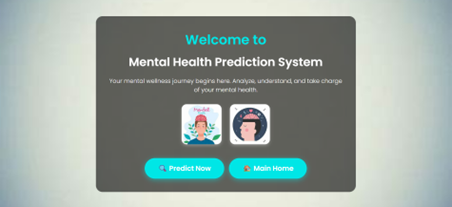
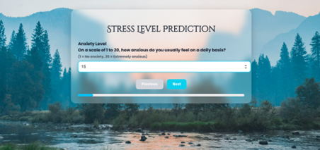
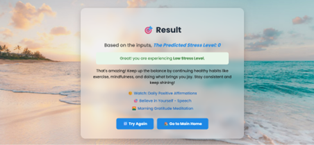
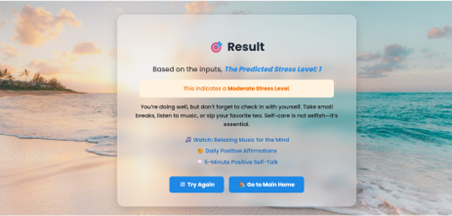
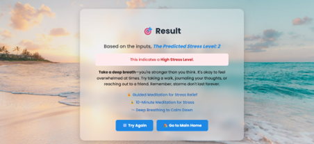

# 🧠 Stress Level Prediction System

A machine learning-based desktop application that analyzes various personal and academic/lifestyle parameters to predict an individual's stress level as **Low (0), Moderate (1), or High (2)**. The system aims to help users gain insights into their mental well-being using structured data inputs.

---

## 📌 Features

- 📊 **Data Analysis:** Considers multiple factors like depression, workload, sleep, and study pressure.
- 🧠 **Stress Prediction:** Predicts stress level as 0 (Low), 1 (Moderate), or 2 (High).
- 🧮 **Model Support:** Uses the **Random Forest** algorithm for high accuracy and reliability.
- 🧾 **User-Friendly Interface:** Simple input form to collect user parameters and display results.
- 💾 **CSV Integration:** Uses a structured CSV dataset with over 1100 integer-based features.

---

## 🛠️ Technologies Used

---

## 📂 Dataset

- 📄 The dataset contains **~1100 columns**, each representing quantified responses to various factors.
- 🎯 Target label: `Stress Level` (0 - Low, 1 - Moderate, 2 - High)

---

## 📸 Screenshots

| 🏠 Home Page | 📝 Input Form |
|--------------|----------------------|
|  |  |

| ✅ Result - Low Stress | ⚠️ Result - Moderate Stress |
|------------------------|-----------------------------|
|  |  |

| 🚨 Result - High Stress |
|--------------------------|
|  |

---

